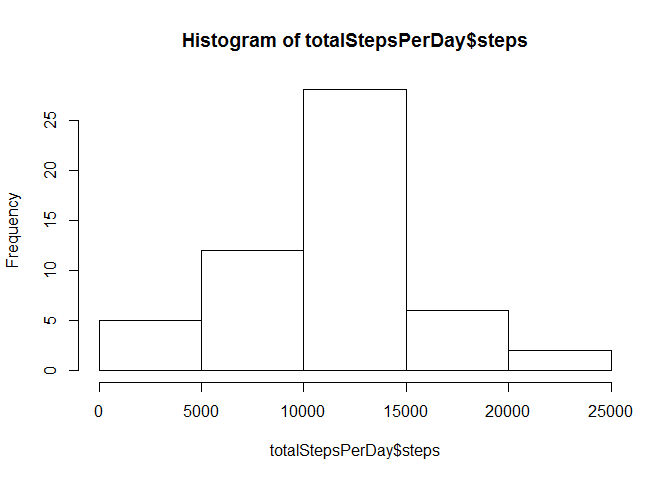
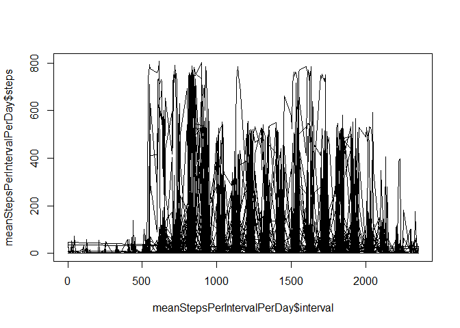
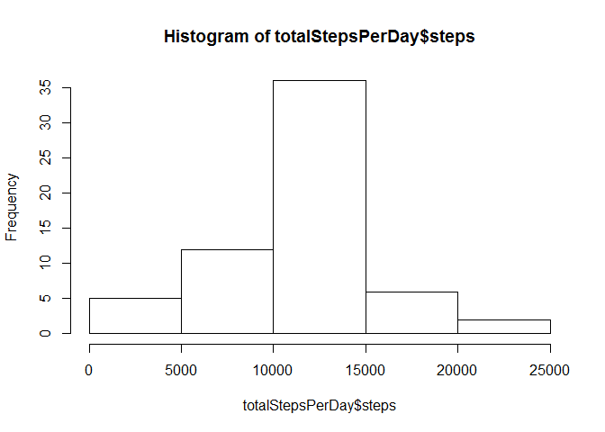
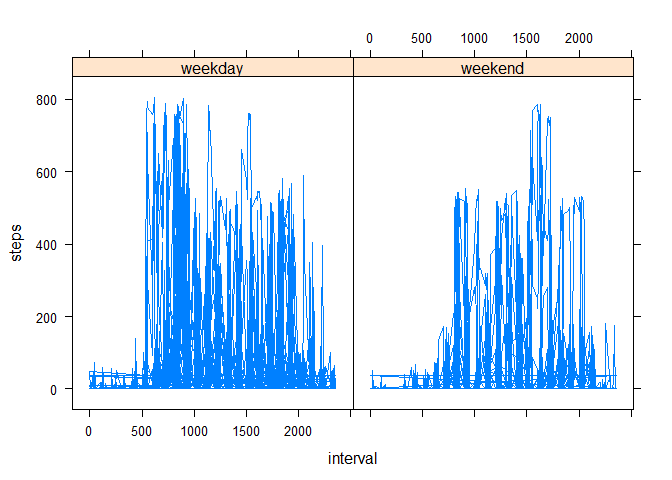

# Reproducible Research: Peer Assessment 1

## Introduction

This assignemnt uses the data from a personal activity monitoring device. The device collects data at 5 minute intervals through out the day. This data set is comprised of two months of data from an anonymous individual collected during the months of October and November 2012 and includes the number of steps taken in 5 minute intervals each day.

## Assignment

The goal of the assignment is to write a report that answers a series of questions about the data using a single R markdown document that can be processed by knitr and be transformed into an HTML file.

This type of analysis that combines text with code and results is known as literate programming. This approached to programming was introduced by Donald Knuth.

## Loading and preprocessing the data

The data for this assignment is stored in activity.zip. We will unzip this file and assume the document is being run where the file has been unzipped.  

1.) We will load the data using the read.csv() funtion:


```r
activityData <- read.csv("activity/activity.csv")
```

To get an idea of the data loaded, we will look at the head and tail of the data.

The head of the data reveals there are some missing values or NAs.


```r
head(activityData, 5)
```

```
##   steps       date interval
## 1    NA 2012-10-01        0
## 2    NA 2012-10-01        5
## 3    NA 2012-10-01       10
## 4    NA 2012-10-01       15
## 5    NA 2012-10-01       20
```

From the tail of the data, we can see the interval ranges from 0 to 2355 in 5 minute intervals.


```r
tail(activityData, 5)
```

```
##       steps       date interval
## 17564    NA 2012-11-30     2335
## 17565    NA 2012-11-30     2340
## 17566    NA 2012-11-30     2345
## 17567    NA 2012-11-30     2350
## 17568    NA 2012-11-30     2355
```

2.) If necessary, we can process or transform the data into a format suitable for our analysis. 

In this case, we will work with the data as is and peform no additional transformation steps before we start our analysis.

## What is mean total number of steps taken per day?

For this part of the assignment, we have been asked to ignore the missing values in the dataset.  

We will filter out the missing data by using  the complete.cases() function and save our filtered data into a variable called activityDataClean.


```r
activityDataClean <- activityData[complete.cases(activityData),]
```

We will look at the head and tail of the data to confirm there are no missing values in contrast to the the head and tail preview of the uncleaned activityData.


```r
head(activityDataClean)
```

```
##     steps       date interval
## 289     0 2012-10-02        0
## 290     0 2012-10-02        5
## 291     0 2012-10-02       10
## 292     0 2012-10-02       15
## 293     0 2012-10-02       20
## 294     0 2012-10-02       25
```

```r
tail(activityDataClean)
```

```
##       steps       date interval
## 17275     0 2012-11-29     2330
## 17276     0 2012-11-29     2335
## 17277     0 2012-11-29     2340
## 17278     0 2012-11-29     2345
## 17279     0 2012-11-29     2350
## 17280     0 2012-11-29     2355
```

Now, we are ready to begin our analysis.

1.) Calculate the total number of steps taken per day.

We will use the aggreate() function to calculate the total number of steps taker per day. We saved the results into a variable called totalStepsPerDay.


```r
totalStepsPerDay <- aggregate(steps ~ date, data = activityDataClean, sum)
```

2.) Make a historgram of the total number of steps taken each day.


```r
hist(totalStepsPerDay$steps)
```

 

3.) Calculate and report the mean and median of the total number of steps taken per day.

We will use the summary() function to provide a summary of statistics on the data, including the mean and median:


```r
summary(totalStepsPerDay$steps)
```

```
##    Min. 1st Qu.  Median    Mean 3rd Qu.    Max. 
##      41    8841   10760   10770   13290   21190
```

## What is the average daily activity pattern?

1.) Make a time series plot (i.e. type = "l") of the 5-minute interval (x-axis) and the average number of steps taken, averaged across all days (y-axis).


```r
meanStepsPerIntervalPerDay <- aggregate(steps ~ interval + date, data = activityDataClean, mean)
plot(x=meanStepsPerIntervalPerDay$interval,y=meanStepsPerIntervalPerDay$steps,type="l")
```

 

2. Which 5-minute interval, on average across all the days in the dataset, contains the maximum number of steps?


```r
maxIntervalRow <- meanStepsPerIntervalPerDay[which.max(meanStepsPerIntervalPerDay$steps),]
maxInterval <- maxIntervalRow["interval"]
maxSteps <- maxIntervalRow["steps"]
print(maxInterval)
```

```
##       interval
## 14476      615
```

```r
print(maxSteps)
```

```
##       steps
## 14476   806
```

The 5-minute interval containing the maximum number of steps on average is the inteveral 615 with 806 steps.

## Imputing missing values

Note, there are a number of days/intervals where there are missing values (coded as NA). The presenece of missing days can introduce bias into the calculations or summaries of the data.

1.) Calculate and report the number of missing values in the dataset (i.e. the total number of rows with NAs).

The total number of missing values in the dataset is:


```r
nrow(activityData[activityData$steps == "NA",])
```

```
## [1] 2304
```

2.) Devise a strategy for filling in all the missing values in the dataset. The strategy does not need to be sophisticated.

We will replace all NAs by the average number of steps of the available complete data, i.e. the cleaned data:


```r
activityData[is.na(activityData)] <- mean(activityDataClean$steps)
```

3.) Create a new dataset that is equal to the original dataset but with the missing data filled in.

In the code above, we actually modified the orginal dataset in place by identifiying the rows with NAs with the is.na function and setting the NA value to the mean of the steps for all data collected.

4.) Make a histogram of the total number of steps taken each day and calculate and report the mean and median total number of steps taken per day.

We make a histogram of the dataset with the missing values filled in. Note, this is the exact code used in answering the question "What is mean total number of steps taken per day?" except we are using the modified activityData instead of the activityDataClean used earlier in the report.


```r
totalStepsPerDay <- aggregate(steps ~ date, data = activityData, sum)
hist(totalStepsPerDay$steps)
```

 

```r
summary(totalStepsPerDay$steps)
```

```
##    Min. 1st Qu.  Median    Mean 3rd Qu.    Max. 
##      41    9819   10770   10770   12810   21190
```

Do these values differ from the estimates from the first part of the assignment? What is the impact of imputing missing data on the estimates of the total daily number of steps?

The values differ slightly from the estimates obtained from the first part of the assignment. Specifically, the median value increased when compared to the first part of the assignment. This increase makes sense because we assumed the person kept working out during the missing values. An alternative would have been to assume a value of zero steps, i.e. we would be assuming the person did not work out during the missing values. This would have probably decreased the median value of steps.  

## Are there differences in activity patterns between weekdays and weekends?

Use the dataset with the filled-in missing values for this part.

1.) Create a new factor variable in the dataset with two levels - "weekday" and "weekend" indicating whether a given date is weekday or weekend day.


```r
activityData$DayType <- ifelse((as.POSIXlt(activityData$date, format='%Y-%m-%d')$wday %in% c(0, 6)),"weekend","weekday")
head(activityData, 5)
```

```
##     steps       date interval DayType
## 1 37.3826 2012-10-01        0 weekday
## 2 37.3826 2012-10-01        5 weekday
## 3 37.3826 2012-10-01       10 weekday
## 4 37.3826 2012-10-01       15 weekday
## 5 37.3826 2012-10-01       20 weekday
```

2.) Make a panel plot containing a time series plot (i.e. type = "l") of the 5-minute interval (x-axis) and the average number of steps taken, averaged across all weekday days or weekend days (y-axis). 


```r
library(lattice)
xyplot(steps ~ interval | factor(DayType), data=activityData,
type='l')
```

 

There are differences between weekdays and weekends activity patterns. During the weekdays, there is increased activity in the early mornings. During the weekends, the increased activity occurs during the late afternoons.
